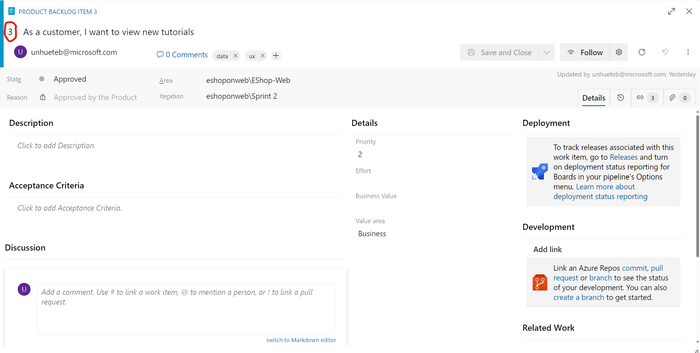
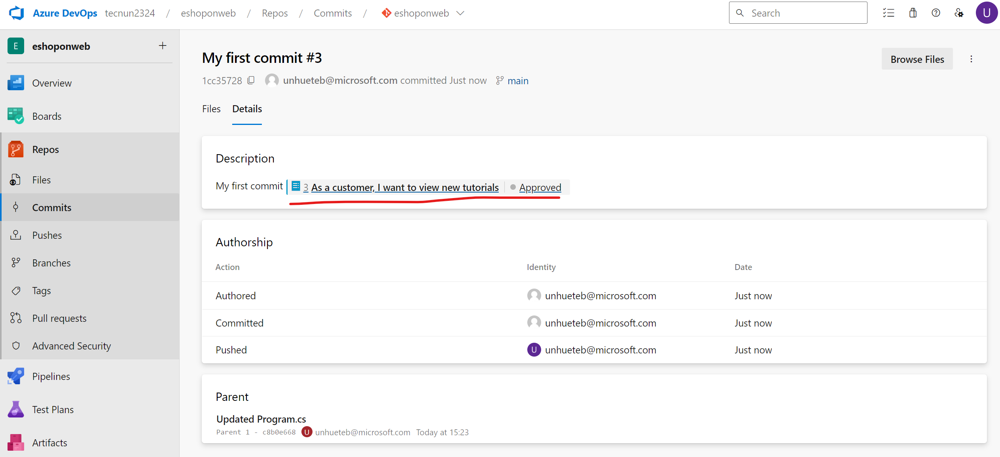
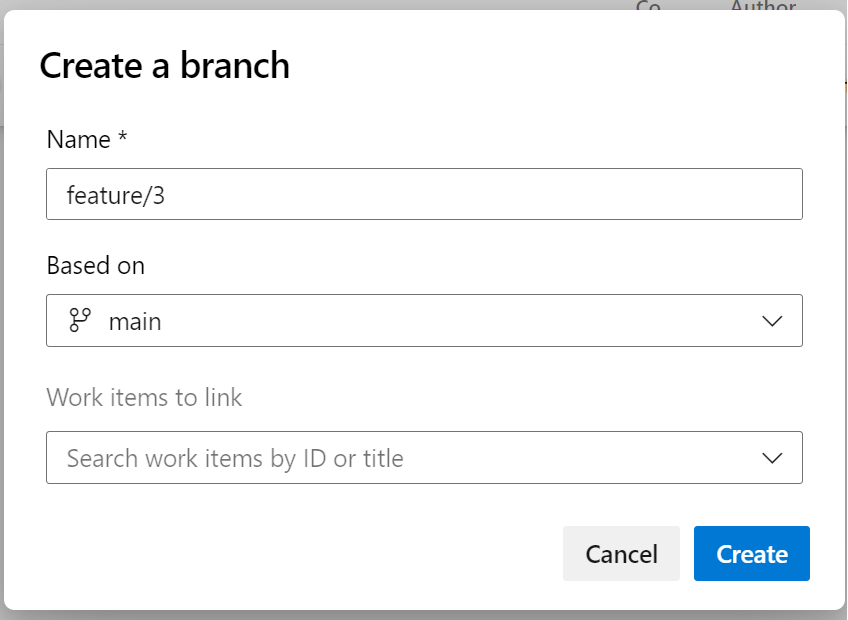
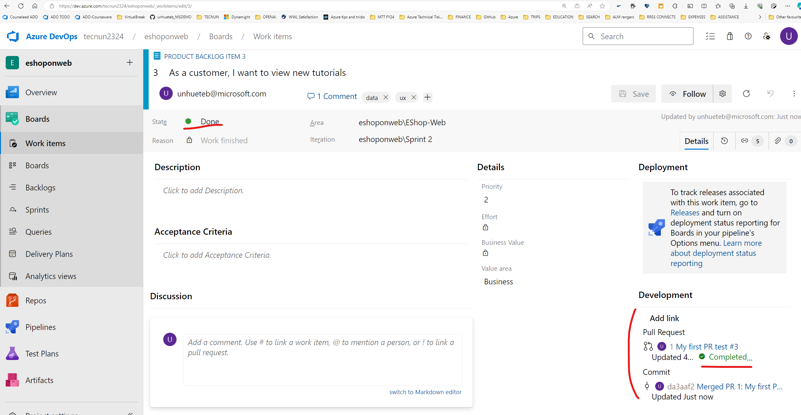

---
lab:
    title: 'Version Controlling with Git in Azure Repos'
    module: 'Module 02: Work with Azure Repos and GitHub'
---

# Version Controlling with Git in Azure Repos

## Student lab manual


## Lab overview

Azure DevOps supports two types of version control, Git and Team Foundation Version Control (TFVC). Here's a quick overview of the two version control systems:

- **Team Foundation Version Control (TFVC)**: TFVC is a centralized version control system. Typically, team members have only one version of each file on their dev machines. Historical data is maintained only on the server. Branches are path-based and created on the server.

- **Git**: Git is a distributed version control system. Git repositories can live locally (on a developer's machine). Each developer has a copy of the source repository on their dev machine. Developers can commit each set of changes on their dev machine and perform version control operations such as history and compare without a network connection.

**Git is the default version control provider for new projects**. You should use Git for version control in your projects unless you need centralized version control features in TFVC.


## Estimated timing: 60 minutes

## Instructions

### Exercise 0: Configure the lab prerequisites

In this exercise, you will set up the prerequisites for the lab, which consist of a new Azure DevOps project with a repository based on the [eShopOnWeb](https://github.com/MicrosoftLearning/eShopOnWeb).


#### Task 1:  Import eShopOnWeb Git Repository

In this task you will import the eShopOnWeb Git repository that will be used by several labs.

1. On your lab computer, in a browser window open your Azure DevOps organization and the previously created **eShopOnWeb-NAME** project. Click on **Repos>Files** , **Import**. On the **Import a Git Repository** window, paste the following URL https://github.com/MicrosoftLearning/eShopOnWeb.git  and click on **Import**:

    

2. The repository is organized the following way:
    - **.ado** folder contains Azure DevOps YAML pipelines
    - **.devcontainer** folder container setup to develop using containers (either locally in VS Code or GitHub Codespaces)
    - **.azure** folder contains Bicep&ARM infrastructure as code templates used in some lab scenarios.
    - **.github** folder container YAML GitHub workflow definitions.
    - **src** folder contains the .NET 7 website used on the lab scenarios.

### Exercise 1: Save work with commits


When you make changes to your files, Git will record the changes in the  repository. You can select the changes that you want to commit by staging them. You can make more commits as you continue to work and push the changes to others when they are ready to be shared.

Git commits consists of the following:

- The file(s) changed in the commit. Git keeps the contents of all file changes in your repo in the commits. This keeps it fast and allows intelligent merging.
- A reference to the parent commit(s). Git manages your code history using these references.
- A message describing a commit. You give this message to Git when you create the commit. It's a good idea to keep this message descriptive, but to the point.

#### Task 1: Commit changes

In this task, you will use Azure DevOps Repos  to commit changes. For simplicity we will work with the repository directly on the server/cloud (instead of the local copy of the repository).

1. Go to your **eShopOnWeb-NAME** project and click on **Repos>Files**. Navigate to the **/eShopOnWeb/src/Web/Program.cs** file and select it. This will automatically display its content in the details pane.
2. On the first line add the following comment:

    ```csharp
    // My first change
    ```

    > **Note**: It doesn't really matter what the comment is since the goal is just to make a change.

1. On a separated tab, inside your project, go to **Boards>Backlogs**. Try to find the PBI with title **As a customer, I want to view new tutorials**. Open it, and you will see the work item identifier on the tope left corner. Copy and keep it in a notepad. 



3. Come back to the previous tab in **Repos>Files**, Press **Commit** to save the previous change.

4. In the Commit window, add the following comment : **My first commit** and also include the work item identifier for the PBI , for example, **#3** inside the comment section. This will relate the code change to the work item. Leave defaults and click on **Commit**.


#### Task 2: Review commits

In this task, you will use the Azure DevOps portal to review commits.


2. In the vertical navigational pane of the Azure DevOps portal, in the **Repos** section, select **Commits**.
3. Verify that your commit appears at the top of list.

    

4. Click on it, under **Details** you will see the work item is identified.

    


### Exercise 2: Work with branches

In this exercise, you will step through scenarios that involve branch management by using Visual Studio Code and the Azure DevOps portal.

You can manage in your Azure DevOps Git repo from the **Branches** view of **Azure Repos** in the Azure DevOps portal. You can also customize the view to track the branches you care most about so you can stay on top of changes made by your team.

Committing changes to a branch will not affect other branches and you can share branches with others without having to merge the changes into the main project. You can also create new branches to isolate changes for a feature or a bug fix from your main branch and other work. Since the branches are lightweight, switching between branches is quick and easy. Git does not create multiple copies of your source when working with branches, but rather uses the history information stored in commits to recreate the files on a branch when you start working on it. Your Git workflow should create and use branches for managing features and bugfixes. The rest of the Git workflow, such as sharing code and reviewing code with pull requests, all work through branches. Isolating work in branches makes it very simple to change what you are working on by simply changing your current branch.

#### Task : Create a new branch in Azure Repos (Server)

In this task, you will create a branch directly in Azure Repos.

1. From your Azure DevOps project, go to **Repos>Branches**.

2. If you see other branches that are not **main**, click on ellipsis icon (3 dots) and delete them. 
3. Now click on **New branch**. Use **main** as the base, and provide the following name **feature/WIT-NUMBER** (replace WIT-NUMBER for the identifier of previous work item, to identify this branch as the one working on that specific PBI, **for example, feature/3** )

    

4. Click on **Create**.
5. The new branch will be created, were you can start working on that feature in an isolated way. 

#### Task : Branch Policies

In this task, you will use the Azure DevOps portal to add policies to the main branch and only allow changes using Pull Requests that comply with the defined policies. You want to ensure that changes in a branch are reviewed before they are merged.

For simplicity we will work directly on the web browser repo editor (working directly in origin), instead of using the local clone in VS code (recommended for real scenarios).

1. Switch to the web browser displaying the **Mine** tab of the **Branches** pane in the Azure DevOps portal.
2. On the **Mine** tab of the **Branches** pane, hover the mouse pointer over the **main** branch entry to reveal the ellipsis symbol on the right side.
3. Click the ellipsis and, in the pop-up menu, select **Branch Policies**.

    

4. On the **main** tab of the repository settings, enable the option for **Require minimum number of reviewers**. Add **1** reviewer and check the box **Allow requestors to approve their own changes**(as you are the only user in your project for the lab)
5. On the **main** tab of the repository settings, enable the option for **Check for linked work items** and leave it with **Required** option.

    

#### Task: Testing branch policy

In this task, you will use the Azure DevOps portal to test the policy and create your first Pull Request.

1. In the vertical navigational pane of the of the Azure DevOps portal, in the **Repos>Files**, make sure the **main** branch is selected (dropdown above shown content).
2. To make sure policies are working, try making a change and committing it on the **main** branch, navigate to the **/eShopOnWeb/src/Web/Program.cs** file and select it. This will automatically display its content in the details pane.
3. On the first line add the following comment:

    ```csharp
    // Testing main branch policy
    ```

4. Click on **Commit > Commit**. You will see a warning: changes to the main branch can only be done using a Pull Request.

    

5. Click on **Cancel** to skip the commit.

#### Task: Working with Pull Requests

In this task, you will use the Azure DevOps portal to create a Pull Request, using the **feature/x** branch to merge a change into the protected **main** branch. An Azure DevOps work item with be linked to the changes to be able to trace pending work with code activity.


3. Go back to the vertical navigational pane of the of the Azure DevOps portal, in the **Repos>Files**, make sure the **feature/x** branch is selected.
4. Navigate to the **/eShopOnWeb/src/Web/Program.cs** file and make the following change on the first line:

    ```csharp
    // Testing my first PR
    ```

5. Click on **Commit > Commit**, and add the following comment **My first PR test #WORKITEMID** (replace WORKITEMID it by the work item identifier used in the lab, example, #3). This time the commit works, **feature/x** branch has no policies.
6. A message will pop-up, proposing to create a Pull Request (as you **featue/x** branch is now ahead in changes, compared to **main**). Click on **Create a Pull Request**.

    

7. In the **New pull request** tab, leave defaults and click on **Create**.
8. The Pull Request will show some failed/pending requirements, based on the policies applied to our target **main** branch.
    - Proposed changes should have a work item linked
    - At least 1 user should review and approve the changes.

9. On the right side options, click on the **+** button next to **Work Items**. Link the previously created work item to the Pull Request by clicking on it. You will see one of the requirements changes  status.

    

10. Next,  open the **Files** tab to review the proposed changes. In a more complete Pull Request,  you would be able to review files one by one (marked as reviewed) and open comments for lines that may not be clear (hovering the mouse over the line number gives you an option to post a comment).
11. Go back to the **Overview** tab, and on the top-right click on **Approve**. All the requirements will change to green. Now you can click on **Complete**.
12. On the **Complete Pull Request** tab, multiple options will be given before completing the merge:
    - **Merge Type**: 4 merge types are offered, you can review them [here](https://learn.microsoft.com/azure/devops/repos/git/complete-pull-requests?view=azure-devops&tabs=browser#complete-a-pull-request) or observing the given animations. Choose **Merge (no fast forward)**.
    - **Post-complete options**:
        - Check **Complete associated work item...**. It will move associated PBI to **Done** state.

13. Click on **Complete Merge**

14. Open the work item we have related to the Pull Request, it should show all the activity done during the lab under **Development**. The work item is moved automatically to **Done** state.

**TAKE SCREENSHOT TO REFLECT ACTIVITY COMPLETION, SIMILAR TO THE ONE SHOWN BELOW, THE URL SHOULD BE VISIBLE**



#### Task 7: Applying tags

The product team has decided that the current version of the site should be released as v1.1.0-beta.

1. In the vertical navigational pane of the of the Azure DevOps portal, in the **Repos** section, select **Tags**.
2. In the **Tags** pane, click **New tag**.
3. In the **Create a tag** panel, in the **Name** text box, type **v1.1.0-beta**, in the **Based on** drop-down list leave the **main** entry selected, in the **Description** text box, type **Beta release v1.1.0** and click **Create**.

    > **Note**: You have now tagged the repository at this release (the latest commit gets linked to the tag). You could tag commits for a variety of reasons and Azure DevOps offers the flexibility to edit and delete them, as well as manage their permissions.

### Exercise 5: Remove Branch Policies

When going through the different course labs in the order they are presented, the branch policy configured during this lab will block exercises in future labs. Therefore, we want you to remove the configured branch policies.

1. From the Azure DevOps **EShopOnWeb-NAME** Project view, navigate to **Repos** and select **Branches**. Select the **Mine** tab of the **Branches** pane.
2. On the **Mine** tab of the **Branches** pane, hover the mouse pointer over the **main** branch entry to reveal the ellipsis symbol (the ...) on the right side.
3. Click the ellipsis and, in the pop-up menu, select **Branch Policies**.

    

4. On the **main** tab of the repository settings, disable the option for **Require minimum number of reviewers**.
5. On the **main** tab of the repository settings, disable the option for **Check for linked work items**.

    

6. You have now disabled/removed the branch policies for the main branch.

7. For simplicity, following lab will work directly in **main** branch. Delete **feature/x** branch. 
    

## Review

In this lab, you used the Azure DevOps portal to manage branches and repositories.
