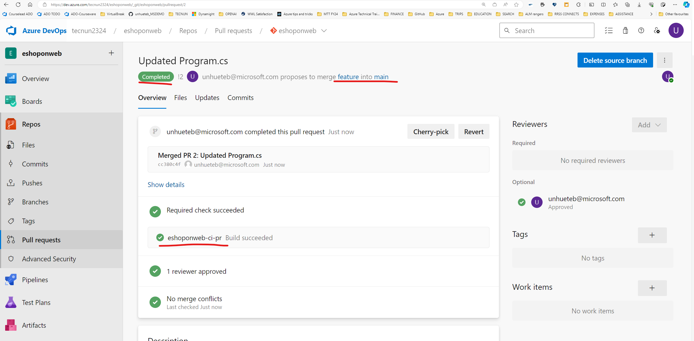
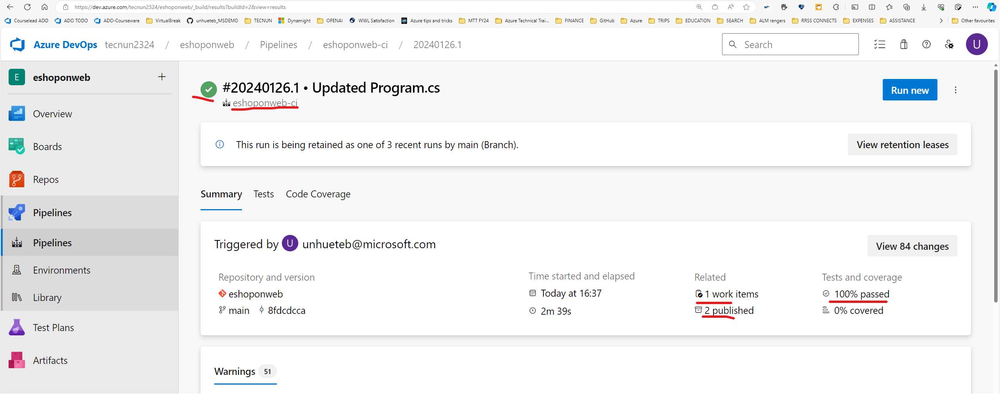

# LAB 03 Enabling Continuous Integration with Azure Pipelines

## Student lab manual

## Lab overview

In this lab, you will learn how to define build pipelines in Azure DevOps using YAML.
The pipelines will be used in two scenarios:

- As part of Pull Request validation process.
- As part of the Continuous Integration implementation.

## Objectives

After you complete this lab, you will be able to:

- Include build validation as part of a Pull Request.
- Configure CI pipeline as code with YAML.

## Estimated timing: 45 minutes

## Instructions


### Exercise 1: Include build validation as part of a Pull Request

In this exercise, you will include build validation to validate a Pull Request.

#### Task 1: Import the YAML build definition

In this task, you will import the YAML build definition that will be used as a Branch Policy to validate the pull requests.

Let's start by importing the build pipeline named [eshoponweb-ci-pr.yml](https://github.com/MicrosoftLearning/eShopOnWeb/blob/main/.ado/eshoponweb-ci-pr.yml).

1. Go to **Pipelines>Pipelines**
2. Click on **Create Pipeline** or **New Pipeline** button
3. Select **Azure Repos Git (YAML)**
4. Select the **eShopOnWeb** repository
5. Select **Existing Azure Pipelines YAML File**
6. Select the **/.ado/eshoponweb-ci-pr.yml** file then click on **Continue**

    The build definition consists of the following tasks:
    - **DotNet Restore**: With NuGet Package Restore you can install all your project's dependency without having to store them in source control.
    - **DotNet Build**: Builds a project and all of its dependencies.
    - **DotNet Test**: .Net test driver used to execute unit tests.
    - **DotNet Publish**: Publishes the application and its dependencies to a folder for deployment to a hosting system. In this case, it's **Build.ArtifactStagingDirectory**.

7. Click the **Save** button to save the pipeline definition
8. Your pipeline will take a name based on the project name. Let's **rename** it for identifying the pipeline better. Go to **Pipelines>Pipelines** and click on the recently created pipeline. Click on the ellipsis and **Rename/Move** option. Name it **eshoponweb-ci-pr** and click on **Save**.

#### Task 2: Branch Policies

In this task, you will add policies to the main branch and only allow changes using Pull Requests that comply with the defined policies. You want to ensure that changes in a branch are reviewed before they are merged.

1. Go to **Repos>Branches** section.
2. On the **Mine** tab of the **Branches** pane, hover the mouse pointer over the **main** branch entry to reveal the ellipsis symbol on the right side.
3. Click the ellipsis and, in the pop-up menu, select **Branch Policies**.
4. On the **main** tab of the repository settings, enable the option for **Require minimum number of reviewers**. Add **1** reviewer and check the box **Allow requestors to approve their own changes**(as you are the only user in your project for the lab)
5. On the **main** tab of the repository settings, in the **Build Validation** section, click **+** (Add a new build policy) and in the **Build pipeline** list, select **eshoponweb-ci-pr** then click **Save**.

#### Task 3: Working with Pull Requests

In this task, you will use the Azure DevOps portal to create a Pull Request, using a new branch to merge a change into the protected **main** branch.

1. Navigate to the **Repos** section in the eShopOnWeb navigation and click **Branches**.
2. Create a new branch named **Feature01** based on the **main** branch.
3. Click **Feature** and navigate to the **/eShopOnWeb/src/Web/Program.cs** file as part of the **Feature01** branch
4. Click the **Edit** button in the top-right
5. Make the following change on the first line:

    ```csharp
    // Testing my PR
    ```

6. Click on **Commit > Commit** (leave default commit message).
7. A message will pop-up, proposing to create a Pull Request (as your **Feature** branch is now ahead in changes, compared to **main**). Click on **Create a Pull Request**.
8. In the **New pull request** tab, leave defaults and click on **Create**.
9. The Pull Request will show some pending requirements, based on the policies applied to the target **main** branch.
    - At least 1 user should review and approve the changes.
    - Build validation, you will see that the build **eshoponweb-ci-pr** was triggered automatically

10. Wait for the pipeline to execute succesfully. You want to make sure your code succesfully build/tests before merging changes.

10. After all validations are successful, on the top-right click on **Approve**. Now  you can click on **Complete**.
11. On the **Complete Pull Request** tab, click on **Complete Merge**

**TAKE SCREENSHOT TO REFLECT ACTIVITY COMPLETION, SIMILAR TO THE ONE SHOWN BELOW, THE URL SHOULD BE VISIBLE**



**IMPORTANT** Delete the **feature** branch and delete the branch policies to simplify following activities. 

### Exercise 2: Configure CI Pipeline as Code with YAML

In this exercise, you will configure CI Pipeline as code with YAML.

#### Task 1: Import the YAML build definition for CI

In this task, you will add the YAML build definition that will be used to implement the Continuous Integration.

Let's start by importing the CI pipeline named [eshoponweb-ci.yml](https://github.com/MicrosoftLearning/eShopOnWeb/blob/main/.ado/eshoponweb-ci.yml).

1. Go to **Pipelines>Pipelines**.
2. Click on **New Pipeline** button.
3. Select **Azure Repos Git (YAML)**.
4. Select the **eShopOnWeb** repository.
5. Select **Existing Azure Pipelines YAML File**.
6. Select the **/.ado/eshoponweb-ci.yml** file then click on **Continue**.

    The CI definition consists of the following tasks:
    - **DotNet Restore**: With NuGet Package Restore you can install all your project's dependency without having to store them in source control.
    - **DotNet Build**: Builds a project and all of its dependencies.
    - **DotNet Test**: .Net test driver used to execute unit tests.
    - **DotNet Publish**: Publishes the application and its dependencies to a folder for deployment to a hosting system. In this case, it's **Build.ArtifactStagingDirectory**.
    - **Publish Artifact - Website**: Publish the app artifact (created in the previous step) and make it available as a pipeline artifact.
    - **Publish Artifact - Bicep**: Publish the infrastructure artifact (Bicep file) and make it available as a pipeline artifact.

1. Click on **Save**. Rename it to **eshoponweb-ci**.

#### Task 2: Enable Continuous Integration

The default build pipeline definition doesn't enable Continuous Integration.

1. Click the **Edit** button in the top-right

2. Now, you need to replace the **# trigger:** and **# - main** lines with the following code:

    ```YAML
    trigger:
      branches:
        include:
        - main
      paths:
        include:
        - src/web/*
    ```

    This will automatically trigger the build pipeline if any change is made to the main branch and the web application code (the src/web folder).


3. Click the **Save** button (not **Save and run**) to save the pipeline definition.

#### Task 3: Test the CI pipeline

In this task, you will create a commit into the **main** branch and automatically trigger the CI pipeline.

1. Navigate to the **Repos>Files** section.
4. On the **main** branch, navigate to the **/eShopOnWeb/src/Web/Program.cs** file and click **Edit** in the top-right
5. Remove the first line:

    ```csharp
    // Testing my PR
    ```
1. Commit (leave defaults, make sure it uses main branch).
13. Go back to **Pipelines>Pipelines**, you will notice that the build **eshoponweb-ci** was triggered automatically after the code was merged.
14. Click on the **eshoponweb-ci** build then select the last run.
15. Wait until the pipeline runs succesfully, review all results given:
- Sucessful building/testing
- Related work items
- Generated artifacts

**TAKE SCREENSHOT TO REFLECT ACTIVITY COMPLETION, SIMILAR TO THE ONE SHOWN BELOW, THE URL SHOULD BE VISIBLE**



## Review

In this lab, you enabled pull request validation using a build definition and configured CI pipeline as code with YAML in Azure DevOps.
