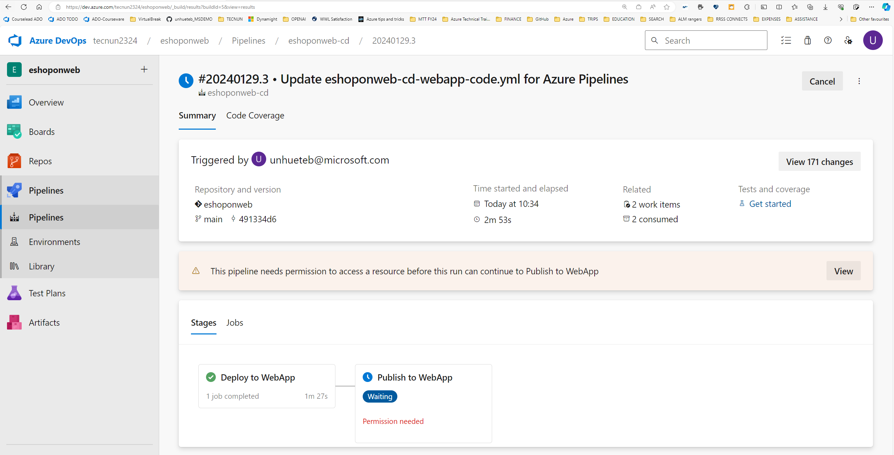
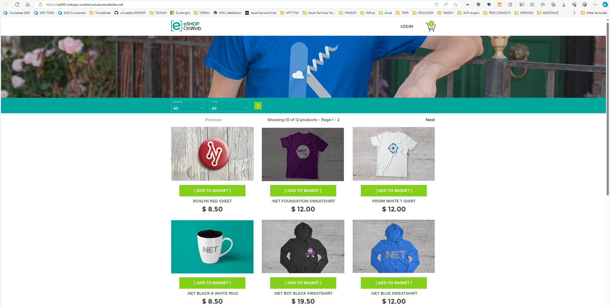
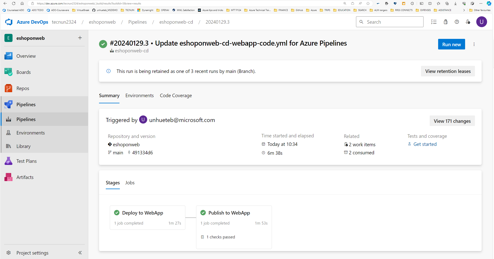
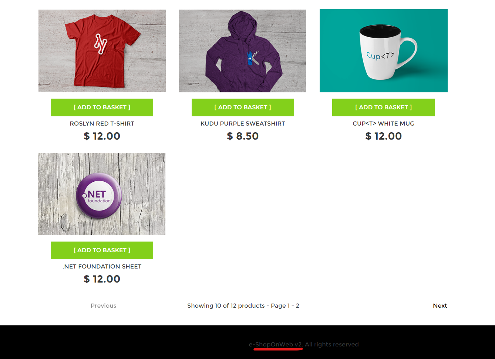

# Configuring Pipelines as Code with YAML

## Student lab manual

## Lab overview

Many teams prefer to define their build and release pipelines using YAML. This allows them to access the same pipeline features as those using the visual designer but with a markup file that can be managed like any other source file. YAML build definitions can be added to a project by simply adding the corresponding files to the repository's root. Azure DevOps also provides default templates for popular project types and a YAML designer to simplify the process of defining build and release tasks.

## Objectives

After you complete this lab, you will be able to:

- Configure CI/CD pipelines as code with YAML in Azure DevOps.

## Estimated timing: 60 minutes

## Instructions


### Exercise 1: Configure CI/CD Pipelines as Code with YAML in Azure DevOps

In this exercise, you will configure CI/CD Pipelines as code with YAML in Azure DevOps.

#### Task 1: Add a YAML build definition

In this task, you will add a YAML build definition to the existing project.

1. Make sure you completed previous lab.
2. Make sure the last pipeline created in the lab is named **eshoponweb-ci**.

Lab03 created a continuous integration (CI) that build/tested and created the binaries we need to deploy our solution, which is composed of an Azure Webapp and our eShopOnWeb website executing inside of it. 

#### Task 2: Add continuous delivery (CD)

In this task, you will add continuous delivery  pipeline, which:

- Deployes an Azure App Service Plan and WebApp using Bicep IaC.
- Publishes a website on top of this service. 

1. Go to **Pipelines>Pipelines**.
2. Click on **New Pipeline** button.
3. Select **Azure Repos Git (YAML)**.
4. Select the **eShopOnWeb** repository.
5. Select **Existing Azure Pipelines YAML File**.
6. Select the **/.ado/eshoponweb-cd-webapp-code.yml** file then click on **Continue**.

    The CD definition is triggered everytime we finish a succesful CI pipeline and it consists of the following tasks:
    - **Download** the files created during the CI process (Bicep and Website)
    - **Bicep Deploy** task to deploy the infrastructure template
    - **WebApp Deploy** publishes the website code on top of webapp.

1. Click on **Save**. Rename the pipeline to **eshoponweb-cd**. 

1. Click on **Edit**. You need tpo change the following:

    1. In Variables:
        - Resource group - replace NAME
        - subscriptionid - replace to d2e3bef4-3e21-4c1f-873d-398932f57163
        - webappname - replace NAME

2. Click on **Save>Save**. Check if the pipeline started to execute, **Run** pipeline if it did not. Wait for the pipeline to execute. 

1. You will see **Publish Website** task failing. We usually need to leave some delay between the resource creation and the publishing of the code. Lets use this opportunity to include some control on the execution of the pipeline.

#### Task 3: Use pipeline environments for approvals

In this task we will use pipeline environments for approvals.

1. In the Azure DevOps portal, go to **Pipelines>Environments**.

1. Click on **Create environment**
    - Name: Development
    - Description: Development
    - Resource: None

1. On the created environment, go to **Approvals and Checks** and click on **+**. Select **Approvals** (Next) and add yourself as approver. Click on **Create**. 

1. Now we are going to use the environment to have a manual approval before the application code is published to the Azure WebApp.

1. Go to **Pipelines>pipelines** and open the **eshoponweb-cd** pipeline for editing. You are going to modify the existing pipeline.

    - Create another stage called **Publish**
    - It will depend on the previous one (Deploy)
    - It will include the environment for manual approvals.
    - Move the publish task to second stage

The second stage will look like this:

```
- stage: Publish
  displayName: Publish to WebApp
  dependsOn: Deploy
  jobs:
  - deployment: Deploy
    pool:
      vmImage: windows-latest
    environment: Development
    strategy:
      runOnce:
        deploy:
          steps:
          #download artifacts
          - download: eshoponweb-ci
          #Publish Website to Azure WebApp
          - task: AzureRmWebAppDeployment@4
            displayName: Publish Website to WebApp
            inputs:
              ConnectionType: 'AzureRM'
              azureSubscription: '$(azureserviceconnection)'
              appType: 'webApp'
              WebAppName: '$(webappname)'
              packageForLinux: '$(Pipeline.Workspace)/**/Web.zip'
```
1. Click on **Save>Save**. Make sure the pipeline started to execute (run manually if it did not).

1. Once the **Deploy** stage is succesful, the pipeline will ask for your approval to follow.

  

1. Go to the **Azure Portal**, you should se your Resource Group with an Azure App Service Plan and App Service (no app code yet).

1. Back in Azure DevOps, click on **View>Permit>Permit**. Click on **Approve**. It should start executing the Publish stage. 

1. Go to the **Azure Portal**, open your App Service. Click on **Browse**. You should see the recently deployed and published website (it may take a bit to load for the  first time).

**TAKE SCREENSHOTS TO REFLECT ACTITIVITY COMPLETION, SIMILAR TO THE ONES SHOWN BELOW, THE URL SHOULD BE VISIBLE**






Now you should be able to: 
1. Make a code change to repository.
1. Validate your changes automatically using Continuous Integration (CI) pipeline.
1. Deploy those changes automatically using your Continuous Deployment pipeline.

#### TASK: Execute CI/CD flow(if time permits)
1. In Azure DevOps, open the CD pipeline for editing and include the following on the first line **trigger:none**. Save the changes. 
1. In Azure DevOps, go to *Repos>Files** and in **src/Web/Views/Shared/_Layout.cshtml** change line 46 to:
```
<div class="esh-app-footer-text hidden-xs"> e-ShopOnWeb v2. All rights reserved </div>
```
1. Click on **Commit>Commit**. 
1. First the CI Pipeline will be executed to validate the code, then the CD Pipeline will start deploying those changes. You will need to approve before publishing stage.

**CALL THE TEACHER TO REVIEW THE SUCCESFUL EXECUTION**



### Exercise 2 : delete azure resources

1. Go to the Azure Portal, open your Resource Group and delete App Service Plan and App Service (keep Resource Group).

## Review

In this lab, you configured CI/CD pipelines as code with YAML in Azure DevOps.
