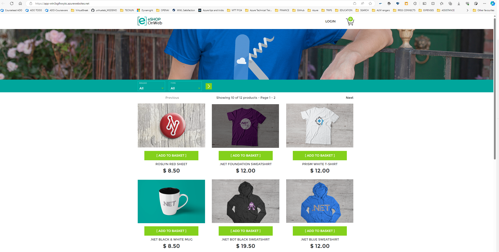

# Deploying Docker containers to Azure App Service web apps

## Student lab manual

## Lab overview

In this lab, you will learn how to use an Azure DevOps CI/CD pipeline to build a custom Docker image, push it to Azure Container Registry, and deploy it as a container to Azure App Service.

## Objectives

After you complete this lab, you will be able to:

- Build a custom Docker image by using a Microsoft hosted Linux agent.
- Push an image to Azure Container Registry.
- Deploy a Docker image as a container to Azure App Service by using Azure DevOps.

## Estimated timing: 30 minutes

## Instructions


### Exercise 1: Import and run the CI pipeline

In this exercise, you will import and run the CI pipeline.


#### Task 0: Disable CI trigger on previouslab pipeline

1. Go to **Pipelines>Pipelines**. Select **eshoponweb-ci** pipeline, Edit, and replace the trigger section by **none**

```
trigger: none
      # branches:
      #   include:
      #   - main
      # paths:
      #   include:
      #   - src/web/*
```
1. Click on **Save>Save**.


#### Task 1: Import and run the CI pipeline

1. Go to **Pipelines>Pipelines**
2. Click on **New pipeline** button
3. Select **Azure Repos Git (YAML)**
4. Select the **eShopOnWeb** repository
5. Select **Existing Azure Pipelines YAML file**
6. Select the **/.ado/eshoponweb-ci-docker.yml** file then click on **Continue**
7. In the YAML pipeline definition, customize:
   - **YOUR-SUBSCRIPTION-ID** with your Azure subscription ID : 1c6b3062-b7a3-4150-b79f-e4197874f94a
   - **rg-az400-container-NAME** replace with the resource group created on previous lab **AZ400-EWebShop-NAME** (replace NAME)
   - **azureServiceConnection** to **azure subs**.

8. Click on **Save and Run (twice)** and wait for the pipeline to execute successfully.

    > **Note**: The deployment may take a few minutes to complete.

    The CI definition consists of the following tasks:
    - **Resources**: It downloads the repository files that will be used in the following tasks.
    - **AzureResourceManagerTemplateDeployment**: Deploys the Azure Container Registry using bicep template.
    - **PowerShell**: Retrieve the **ACR Login Server** value from the previous task's output and create a new parameter **acrLoginServer**
    - [**Docker**](https://learn.microsoft.com/azure/devops/pipelines/tasks/reference/docker-v0?view=azure-pipelines) **- Build**: Build the Docker image and create two tags (Latest and current BuildID)
    - **Docker - Push**: Push the images to Azure Container Registry

9. Your pipeline will take a name based on the project name. Let's **rename** it for identifying the pipeline better. Go to **Pipelines>Pipelines** and click on the recently created pipeline. Click on the ellipsis and **Rename/move** option. Name it **eshoponweb-ci-docker** and click on **Save**.

1. Wait until is succesfully executes. 

10. Navigate to the [**Azure Portal**](https://portal.azure.com), search for the Azure Container Registry in the recently created Resource Group (it should be named **AZ400-EWebShop-NAME**). Open the **Container Registry resource** On the left-hand side click **Repositories** under **Services** and make sure that the repository **eshoponweb/web** was created. When you click the repository link, you should see two tags (one of them is **latest**), these are the pushed images. If you don't see this, check the status of your pipeline.

### Exercise 2: Import and run the CD pipeline

In this exercise, you will configure the service connection with your Azure Subscription then import and run the CD pipeline.


#### Task 1: Import and run the CD pipeline

In this task, you will import and run the CD pipeline.

1. Go to **Pipelines>Pipelines**
2. Click on **New pipeline** button
3. Select **Azure Repos Git (YAML)**
4. Select the **eShopOnWeb** repository
5. Select **Existing Azure Pipelines YAML File**
6. Select the **/.ado/eshoponweb-cd-webapp-docker.yml** file then click on **Continue**
7. In the YAML pipeline definition, customize:
   -- **YOUR-SUBSCRIPTION-ID** with your Azure subscription ID : 1c6b3062-b7a3-4150-b79f-e4197874f94a
   - **rg-az400-container-NAME** replace with the resource group created on previous lab **AZ400-EWebShop-NAME** (replace NAME)
   - **azureServiceConnection** to **azure subs**.

8. Click on **Save and Run (twice)** and wait for the pipeline to execute successfully.

    > **Note**: The deployment may take a few minutes to complete.
    
    > **Important**: If you receive the error message "TF402455: Pushes to this branch are not permitted; you must use a pull request to update this branch.", you need to uncheck the "Require a minimum number of reviewers" Branch protection rule enabled in the previous labs.

    The CD definition consists of the following tasks:
    - **Resources**: It downloads the repository files that will be used in the following tasks.
    - **AzureResourceManagerTemplateDeployment**: Deploys the Azure App Service using bicep template.
    - **AzureResourceManagerTemplateDeployment**: Add role assignment using Bicep

9. Your pipeline will take a name based on the project name. Let's **rename** it for identifying the pipeline better. Go to **Pipelines>Pipelines** and hover on the recently created pipeline. Click on the ellipsis and **Rename/move** option. Name it **eshoponweb-cd-webapp-docker** and click on **Save**.

    > **Note 1**: The use of the **/.azure/bicep/webapp-docker.bicep** template creates an app service plan, a web app with system assigned managed identity enabled, and references the Docker image pushed previously: **${acr.properties.loginServer}/eshoponweb/web:latest**.

    > **Note 2**: The use of the **/.azure/bicep/webapp-to-acr-roleassignment.bicep** template creates a new role assignment for the web app with AcrPull role to be able to retrieve the Docker image. This could be done in the first template, but since the role assignment can take some time to propagate, it's a good idea to do both tasks separately.

#### Task 3: Test the solution

1. In the Azure Portal, navigate to the recently created Resource Group, you should now see three resources (App Service, App Service Plan and Container Registry).

1. Navigate to the Azure Portal, Open App Service, then click **Browse**, this will take you to the website. (it will take some time to load for first time)

Congratulations! In this exercise, you deployed a website using a custom Docker image.

**TAKE SCREENSHOT TO REFLECT ACTITIVITY COMPLETION, SIMILAR TO THE ONE SHOWN BELOW, THE URL SHOULD BE VISIBLE**




## Review

In this lab, you learned how to use an Azure DevOps CI/CD pipeline to build a custom Docker image, push it to Azure Container Registry, and deploy it as a container to Azure App Service.
