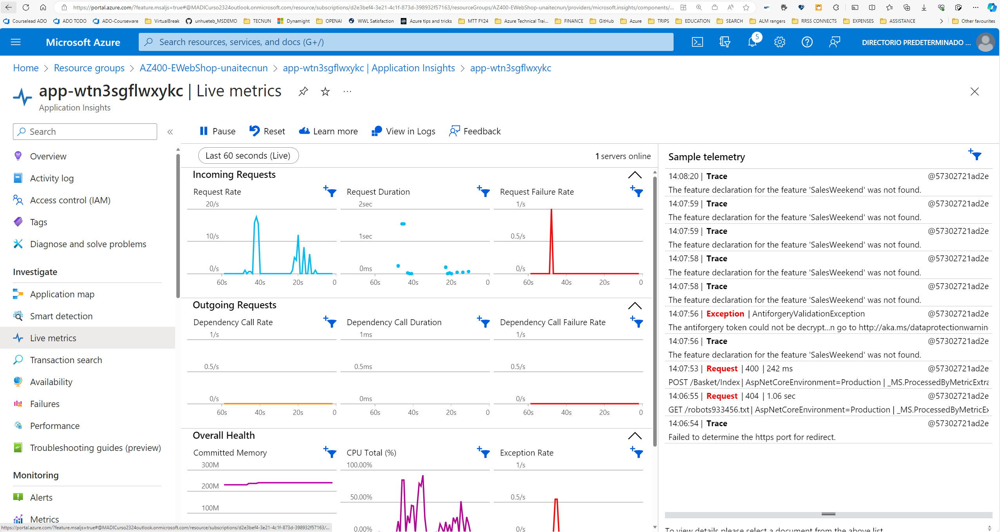
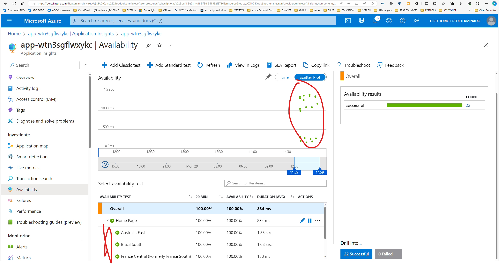
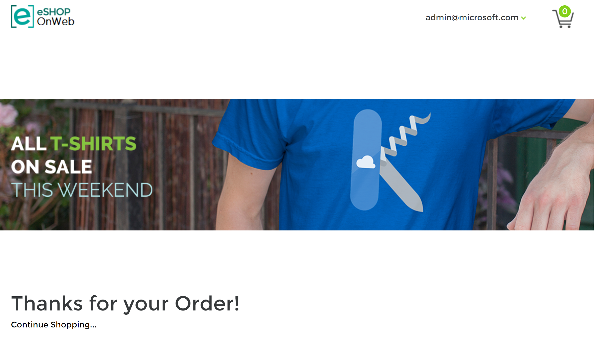
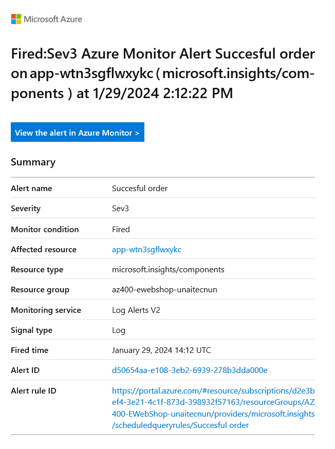

# Monitoring Application Performance with Application Insights 

## Lab overview

On this lab you are going to connect Application Insights to you app to understand the performance and usage of your web solution. 

## Instructions

The lab will be using the components created on lab 5, **make sure lab 5 is completed and resources deployed have NOT been deleted (you will need the App Service that runs your webiste in a Docker container).

### Exercise 1: Connect Application Insights to your App Service (AutoInstrumentation)

In this exercise, you will configure your App Service to get monitored by application insights. 

#### Task 1: Add Application Insights

1. Go to the **Azure Portal**, open your Resource Group, the App Service deployed in lab 5. In the left column, find the option **Application Insights**.

1. Click on **Turn on Application Insights**. Leave defaults to create the resource and click on **Apply**. 

1. Once the application Insights resource is created, you will see a message pointing you to the resource "Your app is connected to Application Insights resource: RESOURCENAME". Click on the resource to open Application Insights.

1. To be sure Application Insights is working, go to the **Live Metrics** section and create some traffic by using your website. You should see the web traffic in the report.

    

#### Task 2: Explore the options 

Explore the options given by Application Insights, like **Transaction Search** where all collected telemetry is shown , or **Logs** where KUSTO queries can be executed against the collected information. 

### Exercise 2 NOT GUIDED Challenges

#### Challenge 1 Create an Availability test

Create an availability tes, that makes sure the website is resposding to Home Page requests every 5 minutes.

You should get something similar to the screenshot below.

**TAKE SCREENSHOT TO REFLECT ACTITIVITY COMPLETION, SIMILAR TO THE ONE SHOWN BELOW, THE URL SHOULD BE VISIBLE**

#### Challenge 2 Create an alert for succesful order 

As part of this challenge, you should create an alert when a succesful order is made, sending an email to your account. 

  

**TIP** use Copilot/ChatGPT for help ;) 

1. You first get notified as being added to the Action Group
2. After 5 minutes or so, you will start getting noitified.

**TAKE SCREENSHOT TO REFLECT ACTITIVITY COMPLETION, SIMILAR TO THE ONE SHOWN BELOW, THE URL SHOULD BE VISIBLE**

